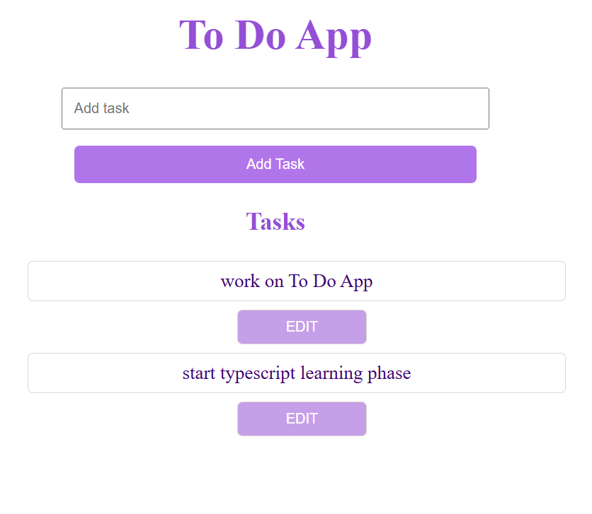
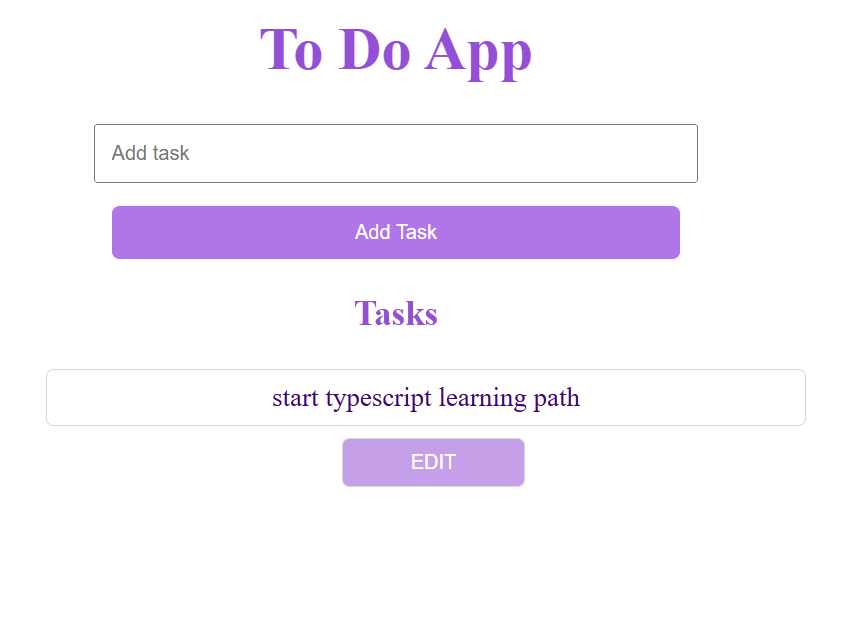
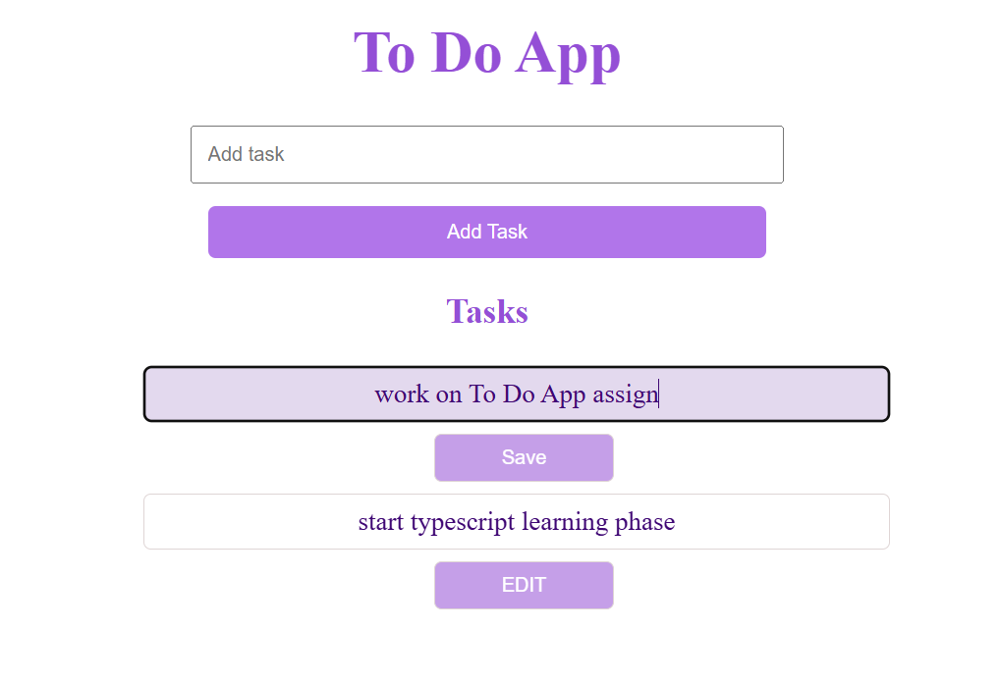

# Simple JavaScript To-Do App
Allow users to add, edit, and delete tasks.

users can
 - Add new tasks
     - Type in the input field and click the "Add" button to create a task
     
- delete task
     - Click on a task to remove it from the list
    

 - Edit existing tasks
     - Click the "Edit" button to make a task editable
     - The button changes to "Save" while editing
     
 

how to run The App
 - clone this repository
      -git clone https://github.com/meronsisay/ToDo-app-js.git
 - open index.html

